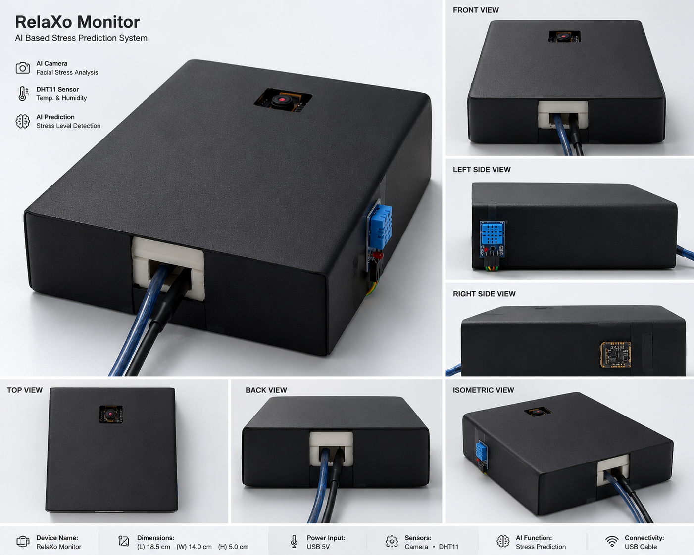

# RelaXo Monitor



## AI-Based Real-Time Stress Prediction System

RelaXo Monitor is an AI and IoT-powered stress monitoring system designed to predict stress levels in real time using physiological and behavioral parameters. The system combines sensor data, facial emotion recognition, voice analysis, movement detection, machine learning, and cloud services to provide intelligent stress assessment and wellness recommendations.

---

## Project Overview

Stress has become a major concern in modern life. RelaXo Monitor helps monitor and predict stress levels by collecting real-time data from multiple sources and analyzing it using Artificial Intelligence and Machine Learning techniques.

The system uses:

- Heart Rate Monitoring
- Temperature Monitoring
- Facial Emotion Recognition
- Voice Stress Analysis
- Movement Detection
- Machine Learning-Based Stress Prediction
- AI-Generated Wellness Suggestions
- Cloud Database Integration

---

## Features

### Real-Time Monitoring
- Heart Rate (BPM) Monitoring
- Temperature Monitoring
- Live Stress Level Detection

### AI-Based Analysis
- Facial Emotion Recognition
- Voice Stress Detection
- Movement Analysis
- Machine Learning Prediction

### Dashboard Features
- Live Sensor Readings
- Stress Level Visualization
- Analytics Dashboard
- Real-Time Monitoring Interface

### Cloud Integration
- Firebase Authentication
- Firebase Realtime Database
- Secure User Data Storage

### Alerts & Reports
- SMS Alert Notifications
- PDF Report Generation
- CSV Data Export

### AI Assistance
- Personalized Wellness Recommendations
- Stress Reduction Suggestions

---

## System Architecture

```text
User
  │
  ▼
Camera + Sensors + Microphone
  │
  ▼
Data Collection
  │
  ▼
Data Processing
  │
  ▼
Machine Learning Model
  │
  ▼
Stress Prediction
  │
  ├── Dashboard
  ├── Firebase Database
  ├── SMS Alerts
  └── AI Recommendations
```

---

## Hardware Components

| Component | Purpose |
|------------|----------|
| ESP32 | Main Controller |
| MAX30102 | Heart Rate Monitoring |
| DHT11 | Temperature & Humidity Monitoring |
| Camera Module | Facial Emotion Recognition |
| Microphone | Voice Stress Analysis |
| USB Interface | Communication & Power |

---

## Software Technologies

- Python
- Flask
- OpenCV
- DeepFace
- Scikit-Learn
- Pandas
- NumPy
- Firebase
- Twilio API
- OpenAI API
- HTML
- CSS
- JavaScript
- Tkinter

---

## Machine Learning Model

### Model Used
- Logistic Regression

### Input Features
- Heart Rate (BPM)
- Temperature

### Output Classes
- Low Stress
- Medium Stress
- High Stress

### Model Accuracy
- 82.76%

---

## Project Structure

```text
RelaXo-Monitor-AI-Stress-Prediction/
│
├── app.py
├── main.py
├── launcher.py
├── gui_dashboard.py
├── train_model.py
├── requirements.txt
├── data.csv
├── README.md
├── relaxo_monitor.png
│
├── templates/
├── static/
├── screenshots/
└── reports/
```

---

## Installation

### Clone Repository

```bash
git clone https://github.com/sourav818/RelaXo-Monitor-AI-Stress-Prediction.git
```

### Open Project Directory

```bash
cd RelaXo-Monitor-AI-Stress-Prediction
```

### Install Dependencies

```bash
pip install -r requirements.txt
```

### Run Application

```bash
python launcher.py
```

---

## Firebase Setup

1. Create a Firebase Project.
2. Enable Authentication.
3. Enable Realtime Database.
4. Download Service Account Credentials.
5. Rename the file to:

```text
firebase_key.json
```

6. Place it in the project root directory.

---

## Screenshots

### Prototype


---

## Future Enhancements

- Mobile Application Integration
- Wearable Device Support
- Deep Learning Models
- Cloud-Based Analytics
- Real-Time Mobile Notifications
- Healthcare Integration
- Multi-User Monitoring

---

## Research Paper

**Title:**
Smart Real-Time Stress Monitoring System Using Artificial Intelligence and Internet of Things

---

## Applications

- Healthcare Monitoring
- Mental Wellness Assessment
- Student Stress Monitoring
- Workplace Stress Management
- Smart Healthcare Systems
- Remote Patient Monitoring

---

## Developed By

### Sourav Paul

Master of Computer Applications (MCA)

Assam down town University

---

## License

This project is developed for educational, academic, and research purposes only.

---

## Star This Repository

If you find this project useful, please consider giving it a ⭐ on GitHub.
